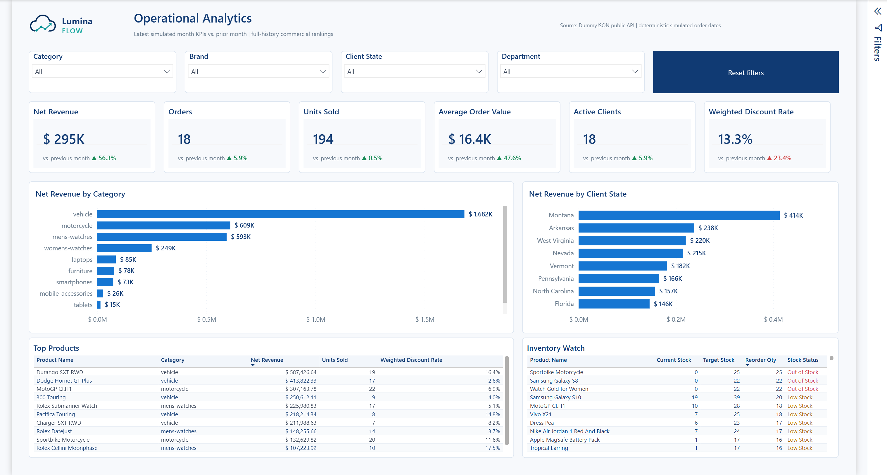
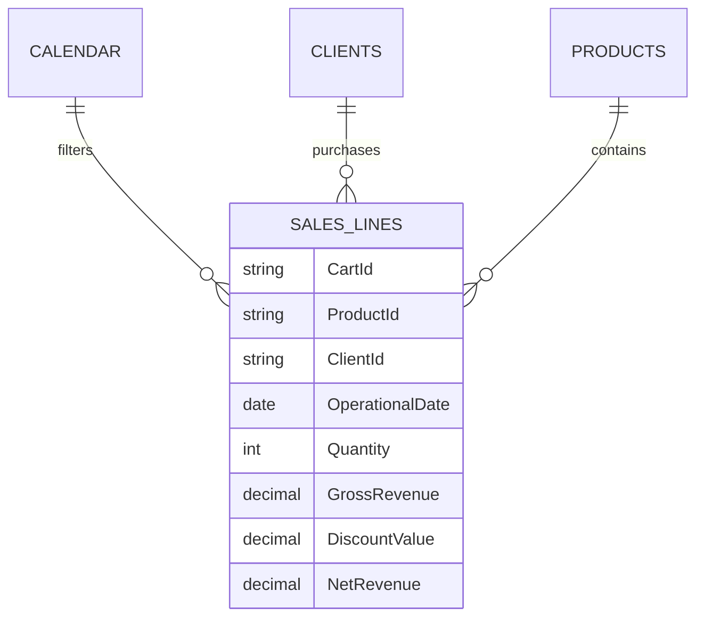

<p align="center">
  
</p>

<h1 align="center">LuminaFlow Operational Analytics</h1>

<p align="center">
  A Power BI decision product for commercial performance and inventory replenishment.
</p>

<p align="center">
  <a href="README.pt-BR.md">Português</a>
  · <a href="power_bi/LuminaFlow.pbip"><strong>Open PBIP source</strong></a>
  · <a href="docs/metrics.md">Metric dictionary</a>
  · <a href="docs/decisions-and-limitations.md">Decision log</a>
</p>

<p align="center">
  <a href="https://github.com/victorn198/luminaflow-operational-analytics/actions/workflows/quality.yml"></a>
  
  
  
</p>



## The business challenge

Commercial and operations managers need one view that connects revenue performance to the products requiring replenishment. A descriptive sales dashboard is not enough: the report must expose exceptions, quantify the gap, and support a restocking decision.

LuminaFlow follows this decision chain:

`Situation -> Exception -> Cause -> Detail -> Action`

- **Situation:** net revenue, orders, units, active clients, average order value, and weighted discount.
- **Exception:** products out of stock or below a transparent target.
- **Cause:** concentration by category, client state, and product.
- **Detail:** ranked commercial and inventory tables.
- **Action:** reorder quantity calculated for each product.

## What the approved snapshot shows

| Signal | Decision implication |
|---|---|
| Latest simulated-period net revenue is **$295K**, up **56.3%** | Growth is strong, but the product mix must be checked before treating it as broad-based improvement |
| Weighted discount increased **23.4%** | Revenue growth should be evaluated together with discount pressure |
| Vehicle is the leading full-history revenue category | Commercial concentration increases dependency on a narrow product group |
| Three visible products are out of stock and several are below target | Replenishment should start with the calculated shortage, not a subjective status label |

Values are DAX results from the approved snapshot, not numbers embedded in the report layout. Refreshing the public synthetic API may change them.

## Inventory decision policy

The API provides current stock but no forecast, lead time, service level, or official target. The report therefore uses a disclosed demonstration heuristic:

```text
Target Stock = max(10, round up(Units Sold * 1.25))
Reorder Qty  = max(0, Target Stock - Current Stock)
```

- **Out of Stock:** current stock equals zero.
- **Low Stock:** current stock is below target.
- **Healthy:** current stock meets or exceeds target.

The heuristic is labeled as portfolio logic and is never presented as a source-provided policy.

## Data model



`DummyJSON products + users + carts -> Power Query -> star schema -> DAX measures -> PBIR report`

See the complete [data model](docs/data-model.md) and [metric definitions](docs/metrics.md).

## Engineering evidence

- Versionable PBIP, PBIR, and TMDL are the canonical source; PBIX is not used for authoring.
- Power Query ingests and shapes three public synthetic endpoints.
- Single-direction relationships run from dimensions to the sales-line fact.
- Visible KPIs and comparisons use explicit DAX measures.
- Gross revenue, discount value, and net revenue are reconciled.
- Reset bookmarks affect slicers without destroying visual sort ownership.
- Synthetic personal attributes remain hidden from report consumers.
- Automated repository checks validate JSON, PBIP references, TMDL presence, and forbidden local cache files.

## Open locally

1. Install Power BI Desktop with PBIP/PBIR support.
2. Clone this repository.
3. Open [`power_bi/LuminaFlow.pbip`](power_bi/LuminaFlow.pbip).
4. Allow access to `https://dummyjson.com` and refresh the model.
5. Open **Operational Overview** and test filters plus the reset bookmark.

## Limitations

- DummyJSON provides synthetic demonstration data, not company transactions.
- Operational dates are deterministic simulations because carts have no transaction dates.
- Currency remains `$`; the source does not declare BRL.
- Margin, purchasing cost, lead time, returns, service level, and demand forecast are unavailable.
- The inventory target is a documented heuristic, not a production replenishment policy.

## License

Repository code and authored assets use the MIT License. Third-party API data remains subject to the source terms.
