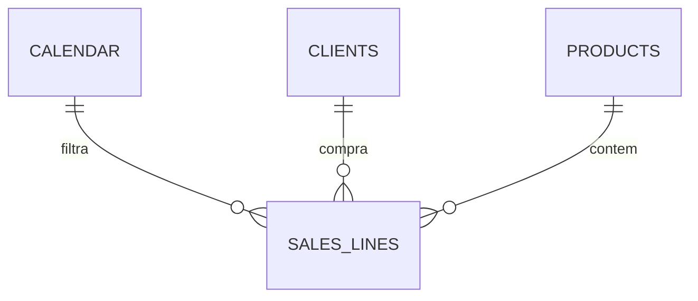

<p align="center">
  
</p>

<h1 align="center">LuminaFlow Operational Analytics</h1>

<p align="center">
  Produto de decisão em Power BI para desempenho comercial e reposição de estoque.
</p>

<p align="center">
  <a href="README.md">English</a>
  · <a href="power_bi/LuminaFlow.pbip"><strong>Abrir fonte PBIP</strong></a>
  · <a href="docs/metrics.md">Dicionário de métricas</a>
  · <a href="docs/decisions-and-limitations.md">Decisões e limitações</a>
</p>


## O desafio de negócio

Gestores comerciais e operacionais precisam conectar desempenho de receita aos produtos que exigem reposição. Um dashboard descritivo não basta: o relatório deve mostrar exceções, quantificar a lacuna e orientar a compra.

A LuminaFlow segue o fluxo:

`Situação -> Exceção -> Causa -> Detalhe -> Ação`

- **Situação:** receita líquida, pedidos, unidades, clientes, ticket e desconto ponderado.
- **Exceção:** produtos sem estoque ou abaixo de uma meta transparente.
- **Causa:** concentração por categoria, estado do cliente e produto.
- **Detalhe:** rankings comerciais e tabela de estoque.
- **Ação:** quantidade de reposição calculada por produto.

## O que o snapshot aprovado mostra

| Sinal | Implicação para a decisão |
|---|---|
| Receita líquida do último período simulado em **$ 295 mil**, alta de **56,3%** | O crescimento é forte, mas o mix precisa ser analisado antes de tratá-lo como melhora generalizada |
| Desconto ponderado aumentou **23,4%** | O crescimento deve ser avaliado junto com a pressão de desconto |
| Veículos lideram a receita histórica por categoria | A concentração aumenta a dependência de um grupo restrito |
| Três produtos visíveis estão sem estoque e vários abaixo da meta | A reposição deve começar pela lacuna calculada, não por um rótulo subjetivo |

Os valores são resultados DAX do snapshot aprovado, não textos fixos no layout. Uma atualização da API sintética pode alterá-los.

## Política de decisão de estoque

A API fornece estoque atual, mas não possui previsão, lead time, nível de serviço ou meta oficial. O case usa uma heurística de demonstração declarada:

```text
Target Stock = max(10, arredondar para cima(Units Sold * 1,25))
Reorder Qty  = max(0, Target Stock - Current Stock)
```

- **Out of Stock:** estoque atual igual a zero.
- **Low Stock:** estoque atual abaixo da meta.
- **Healthy:** estoque atual igual ou superior à meta.

A heurística é identificada como lógica de portfólio e nunca como política fornecida pela fonte.

## Modelo de dados



`DummyJSON products + users + carts -> Power Query -> modelo estrela -> medidas DAX -> relatório PBIR`

Consulte o [modelo completo](docs/data-model.md) e o [dicionário de métricas](docs/metrics.md).

## Evidências de engenharia

- PBIP, PBIR e TMDL são a fonte canônica versionável; PBIX não é usado para autoria.
- Power Query consome e trata três endpoints sintéticos públicos.
- Relacionamentos unidirecionais ligam dimensões à fato de linhas de venda.
- KPIs e comparações visíveis usam medidas DAX explícitas.
- Receita bruta, desconto e receita líquida são reconciliados.
- O bookmark de reset afeta slicers sem destruir a ordenação dos visuais.
- Atributos pessoais sintéticos permanecem ocultos para consumidores.
- Validação automática verifica JSON, referências PBIP, TMDL e caches proibidos.

## Abrir localmente

1. Instale o Power BI Desktop com suporte a PBIP/PBIR.
2. Clone este repositório.
3. Abra [`power_bi/LuminaFlow.pbip`](power_bi/LuminaFlow.pbip).
4. Autorize `https://dummyjson.com` e atualize o modelo.
5. Abra **Operational Overview** e teste filtros e reset.

## Limitações

- DummyJSON contém dados sintéticos, não transações empresariais.
- Datas operacionais são simulações determinísticas porque os carrinhos não possuem data.
- A moeda permanece `$`; a fonte não declara BRL.
- Margem, custo de compra, lead time, devoluções, nível de serviço e previsão não estão disponíveis.
- A meta de estoque é uma heurística documentada, não política de produção.

## Licença

O código e os materiais autorais usam licença MIT. Os dados da API permanecem sujeitos aos termos da fonte.
