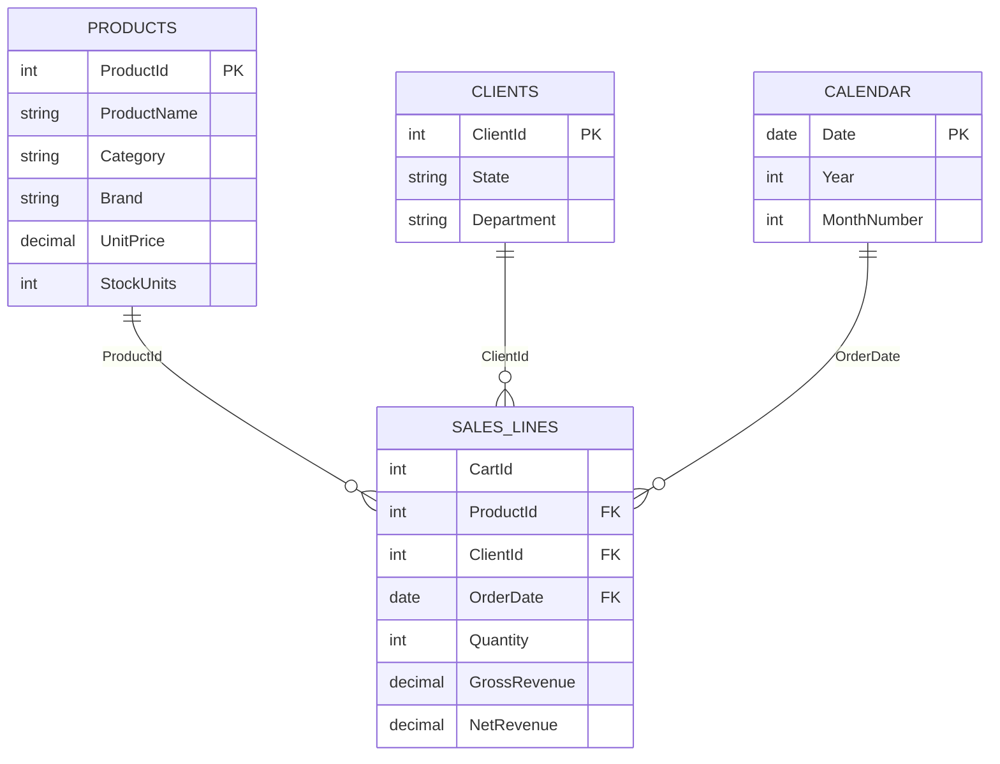

# Data model

## Grain and relationships

- `SalesLines` is the fact table at product-line-in-cart grain.
- `Products`, `Clients`, and `Calendar` filter the fact table through one-to-many, single-direction relationships.
- Technical keys and synthetic personal fields are hidden from report consumers.

## Date caveat

DummyJSON carts do not provide transaction dates. `OrderDate` is generated deterministically from `CartId` to demonstrate period-aware DAX. It is explicitly labeled as simulated operational time and is unsuitable for real trend claims.
